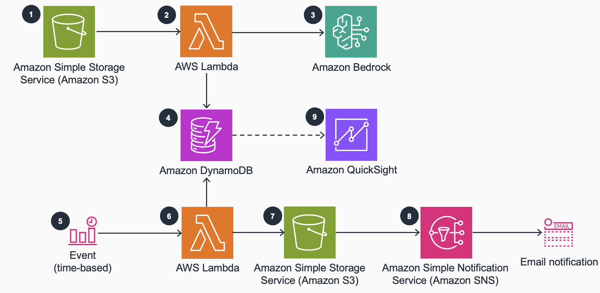

# Generating Product Descriptions with Bedrock

This solution creates a serverless workflow that analyses product reviews using the managed generative AI service, Amazon Bedrock. The analysis is stored in a format that can be easily visualised using Business Intelligence tools, as well as being emailed to a recipient daily.

## Table of Contents

1. [Overview](#overview)
    - [Cost](#cost)
2. [Prerequisites](#prerequisites)
3. [Deployment Steps](#deployment-steps)
4. [Deployment Validation](#deployment-validation)
5. [Running the Guidance](#running-the-guidance)
6. [Next Steps](#next-steps)
7. [Cleanup](#cleanup)
8. [Additional considerations and limitations](#additional-considerations-and-limitations)

## Overview

Online customer reviews have become an invaluable resource for consumers making purchase decisions, whilst providing greater insights into the product or service quality and customer sentiment. By continued monitoring of these reviews over time, businesses can recognise changes in customer perceptions and uncover areas of improvement. 
This solution uses Anthropic’s Claude model through Amazon Bedrock to analyze reviews of a sample product from a fictitious apparel brand.

1. Customer reviews can be imported into an Amazon Simple Storage (Amazon S3)  bucket as JSON objects. This bucket will have event notifications enabled to invoke an Amazon Lambda function to process the objects created or updated.
2. The Lambda function executes business logic to process the customer reviews within the input JSON file. These reviews are then included as context in the pre-defined prompt template used as input to the FM. The prompt has detailed instructions to be followed by the FM to generate a json output with summary, sentiment and action items from the reviews. The function then invokes an FM of choice on Amazon Bedrock.
3. Amazon Bedrock will invoke the FM and respond with the generated output based on the input prompt.
4. The Lambda function will parse the output from Amazon Bedrock and persist the necessary data (summary of reviews, overall sentiment and action items) in Amazon DynamoDB. 
    - The review summary stored in DynamoDB can optionally be displayed on the website to help customers make purchase decisions easily, without needing to navigate through long list of customer reviews.
5. A time triggered EventBridge scheduler invokes a Lambda function once a day that generate a report of the products whose summary and sentiment were updated in DynamoDB in the past 24 hours. 
6. The Lambda function will generate a CSV file with the changes (product, review_summary, sentiment_score and action_items), and persist the CSV on Amazon S3.
7. Amazon S3 event notification, will invoke Amazon Simple Notification Service (Amazon SNS) as soon as the CSV report is uploaded.
8. Amazon SNS then triggers an email to merchandizing and other relevant teams, who can then review the report and resolve any action_items. 
9. Optionally, data stored on DynamoDB can be used to build business dashboards to monitor the customer sentiment about products or services over time.

## Cost

_You are responsible for the cost of the AWS services used while running this Guidance. As of November 2023, the cost for running this Guidance with the default settings in the US West 2 (Oregon) is approximately *TODO* per month for processing 1000 products each month._

This guidance includes the AWS services S3, Lambda, Bedrock, DynamoDB, EventBridge and SNS with costs as follows:

- S3: $0.023 per GB (for the first 50 TB) for storage, $0 for the first 100GB transferred out per month
- Lambda: $0 for the first one million requests per month, $0.0000166667 per GB second thereafter
- Bedrock: Depends on the model. Claude Instant for example is $0.00163 per 1000 input tokens and $0.00551 per 1000 output tokens, and the AI21 Jurassic model is $0.0125 per 1000 input/output tokens
- DynamoDB: $0 for the first 25 GB stored per month, $0.25 per GB thereafter, plus $1.25 per million write request units and $0.25 per million read request units
- EventBridge: $0 for the first 14 million scheduled invocations per month, $1.00 per million thereafter
- SNS: First 1 million Amazon SNS requests per month are free, $0.50 per 1 million requests thereafter plus 1,000 email notifications for free each month, $2.00 per 100,000 thereafter

## Prerequisites

You will need access to an AWS account and the appropriate IAM permissions to deploy the CloudFormation stack.
You will also need to request access to Anthropic Claude 3 on Amazon Bedrock in the us-west-2 (Oregon) region:
1. In the AWS Console, navigate to the [Amazon Bedrock](https://us-west-2.console.aws.amazon.com/bedrock/home?region=us-west-2#/) console.
2. From the side menu, choose [Model access](https://us-west-2.console.aws.amazon.com/bedrock/home?region=us-west-2#/modelaccess)
3. Choose 'Manage model access' and select 'Claude 3 Sonnet'
   - You may have to submit a use case first
4. Confirm your selection at the bottom of the page

Additionally, you will need the AWS CLI installed to package the CloudFormation template.
See [Get started with the AWS CLI](https://docs.aws.amazon.com/cli/latest/userguide/cli-chap-getting-started.html) to install and configure the CLI.

## Deployment Steps

The solution is deployed using a CloudFormation template, but as this relies on Python code files, the template must be packaged first.
To package the template:
1. Create an S3 Bucket in the same region that you will deploy the solution from, noting the name.
2. From the directory containing the CloudFormation template and the Python code, run the following code, replacing `<S3 Bucket>` with the name of the bucket you created.  
`aws cloudformation package --template-file product-review-analysis-cfn-template.yml --s3-bucket <S3 Bucket> --output-template-file product-review-analysis-cfn-template.packaged.yml`  
This creates a packages template file, as well as uploading the code to S3, where it can used by the Lambda functions.

The packaged template file can then be deployed:
1. Navigate to the [CloudFormation console](https://console.aws.amazon.com/cloudformation) and choose 'Create Stack', 'With new resources'
2. Choose 'Template is ready' and 'Upload a template file', then upload the packaged template file.
3. On the next page, specify a name for the stack and an email to receive notifications at
4. Confirm the details on the next two pages and select 'Submit'

## Deployment Validation

The deployment should be successful if all of the above steps complete without error. You can browse the resources created by navigating to the CloudFormation service in the AWS Console, finding the stack, and browsing its resources.

## Running the Guidance

You can try the demo by following these steps:
1. Check your email for a temporary password
2. Access the app from a local browser at #cloud9_public_ip:#web_port
3. Follow the prompts to log in and change your password
4. To create a product description from an image (the default mode), browse for an image file for some product or object
5. Once uploaded, a product description and translations into several languages will be generated

## Next Steps

See the Bedrock [product page](https://aws.amazon.com/bedrock/) for more resources on using Amazon Bedrock.

## Cleanup

The provisioned infrastructure can be deleted by deleting the CloudFormation stack. This will not remove any S3 buckets that are not empty, so it will be necessary to delete these from the S3 console.

## Security

See [CONTRIBUTING](CONTRIBUTING.md#security-issue-notifications) for more information.

## License

This library is licensed under the MIT-0 License. See the [LICENSE](LICENSE) file.
